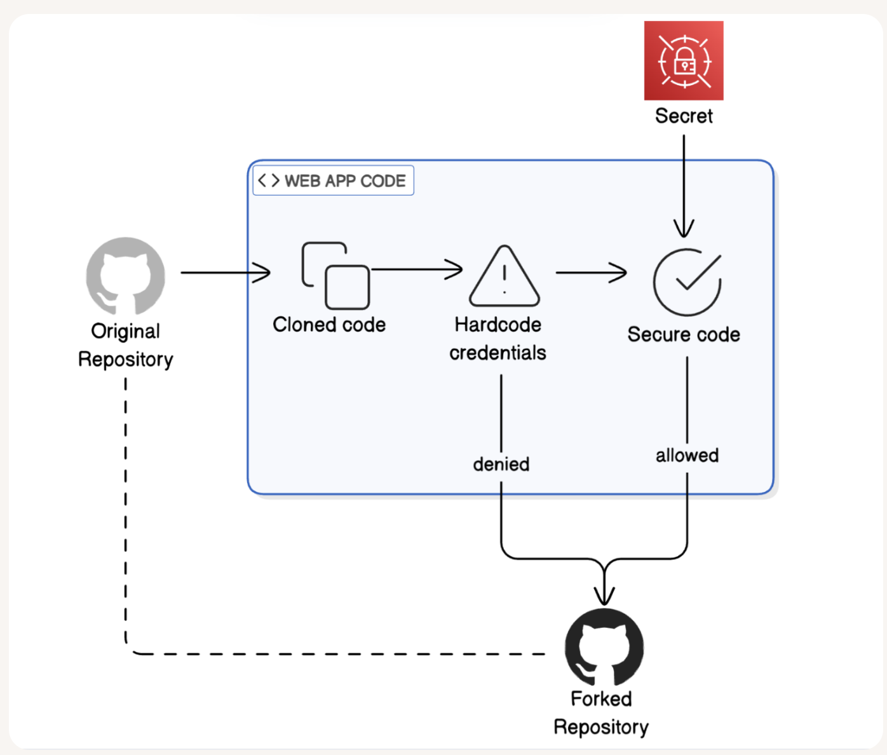

# Secure Secrets with Secrets Manager

**Project Link:** [View Project](http://learn.nextwork.org/projects/aws-security-secretsmanager)

**Author:** Adeem Akhtar  
**Email:** adeemakhtar@gmail.com

---

---

## Introducing Today's Project!

In this project, I will demonstrate the following:
1. Identify how a web app is insecurely storing credentials.
2. See how GitHub's secret scanning feature can block insecure code from being pushed to a repository.
3. Update the web app to use AWS Secrets Manager to store and retrieve credentials securely.
4. Verify that secured web app code can be made public without exposing sensitive credentials.
 I'm doing this project to learn cloud security.

### Tools and concepts

Services I used were AWS Secrets Manager, AWS IAM, 
and GitHub. Key concepts I learnt include securing credentials.

### Project reflection

This project took me approximately 1.5 hours The most challenging part was git rebase It was most rewarding to learn how to rebase the branch commit.

I chose to do this project today because I just finished the theory of AWS Secret Manager.

---

## Hardcoding credentials

In this project, a sample web app is exposing AWS access key and AWS secret access key. It is unsafe to hardcode credentials because anyone who can see the hardcoded credentials can access the AWS account. Once someone else gets access to the credentials, they can use them to access your AWS account, delete resources, steal data, and cause damage.

I've set up the initial configuration with the access key and secret access key. These credentials are just examples, as we are experimenting with the project.

---

## Using my own AWS credentials

As an extension for this project, I also decided to install the required libraries and set up my virtual environment. I installed Python and activated the virtual environment.

When I first ran the app, I ran into an error because there was no AWS access key and AWS secret access key.

To resolve the 'InvalidAccessKeyId' error, I updated AWS access, AWS Secret Access key, along with the region in the config.py file.

---

## Pushing Insecure Code to GitHub

Once I updated the web app code with credentials, I forked the repository so I could have the same repository in my own GitHub account. A fork is different from a clone; forking is making a copy of it in your GitHub account online. If your forked repository is public, anyone can see it!
Whereas cloning a repository, you're creating a local, offline copy. By default, no one can see it since it's stored on your computer.

To connect my local repository to the forked repository, I updated my config.py file. Then I used git add and git commit to stage. Finally, git push uploads the file to the GitHub repo.

GitHub blocked my push because my config.py file contained my AWS secret keys. This is a good security feature because GitHub does not let you push the code to a repo with the secret keys in it to protect the credentials.

---

## Secrets Manager

Secrets Manager is a service that helps you securely store and manage secrets, such as database credentials, API keys, and other sensitive information. Think of it as a digital vault for your secrets. I'm using it to store my access and secret access keys. Other common use cases include 'Database credentials', 'API Keys', 'OAuth tokens', etc.

Another feature in Secrets Manager is secret rotation, which means it's useful in situations where high-risk credentials like database passwords, privileged API keys, and service account credentials are used, and best security practices are to be followed.

Secrets Manager provides sample code in various languages, like Java, Python, Go, Rust, etc.

---

## Updating the web app code

I updated the config.py file to retrieve defining get_secret() function. The get_secret() function will retrieve the secret keys from the secret manager. 

I also added code to config.py to extract AWS_ACCESS_KEY, AWS_SECRET_ACCESS_KEY, and AWS_REGION from the AWS Secret Manager. 

---

## Rebasing the repository

Git rebasing is taking the pointer to the required commit. I used it to point my pointer to the root.

A merge conflict occurred during rebasing because When Git detects conflicting changes in a file, it adds special markers to show you exactly where the conflicts are:
<<<<<<< HEAD marks the beginning of your current version
======= separates the two conflicting versions
>>>>>>> feature-branch marks the end of the incoming changes.
I resolved the merge conflict by deleting the entire section between <<<<<<< HEAD and ======= (this removes the hardcoded credentials)
Then, at the end of the file, delete the ======= line
Delete the >>>>>>> feature-branch line and save the file.

Once the merge conflict was resolved, I verified by opening the config.py file, secondly, there was no push error by GitHub.

---

---
