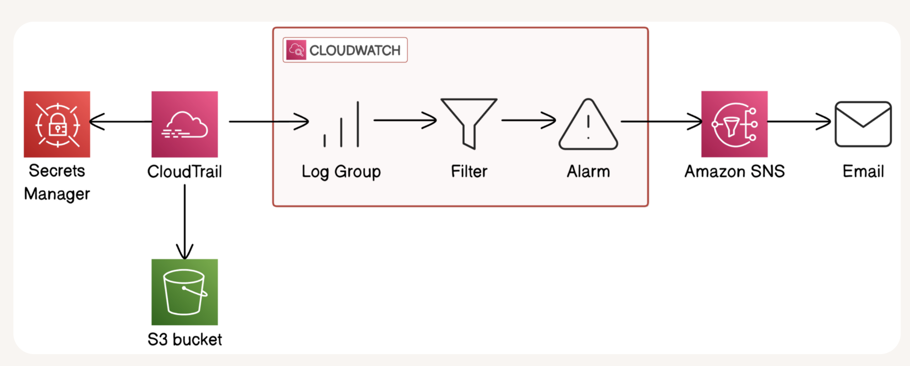

# Build a Security Monitoring System

**Project Link:** [View Project](http://learn.nextwork.org/projects/aws-security-monitoring)

**Author:** Adeem Akhtar  
**Email:** adeemakhtar@gmail.com

---

---

## Introducing Today's Project!

In this project, I will demonstrate the following:
1. Set up AWS CloudTrail to track secret access events.
2. Use AWS CloudWatch to log access attempts and trigger notifications.
3. Create SNS alerts to get notified when your secrets are accessed.

### Tools and concepts

Services I used were as follows:
AWS Secrets Manager
AWS CloudTrail
Amazon CloudWatch
Amazon SNS
Amazon S3
AWS CLI

Key concepts I learnt include:
1. Monitoring of the architecture, especially the secrets.
2. Triggering an alarm when specific patterns are detected.
3. Get notified as soon as possible about any unusual activity.

### Project reflection

This project took me approximately 120 minutes. The most challenging part was troublshooting of the email notification in SNS. It was most rewarding to figure out the subscription should be tested by sending the test emails.

---

## Create a Secret

AWS Secrets Manager is an AWS service. We could use Secrets Manager to protect secrets, which are passwords, API keys, credentials and sensitive information. Instead of storing important credentials in your code or sharing them via email.

To set up for my project, I created a secret called "TopSecretInfo" that contains "I need 3 coffees a day to function".

---

## Set Up CloudTrail

AWS CloudTrail is a monitoring service - think of it as an activity recorder throughout your AWS account. It documents every action taken, like who did what, when they did it, and where they did it from.

CloudTrail events include types like Management Event, Data Event, Insights Event and Network Activity Event.
API Activities are "Read" and "Write"

### Read vs Write Activity

Read API activity happens when someone views but doesn't change anything. For example, listing your S3 buckets, describing EC2 instances.

Write API activity occurs when changes happen - creating, deleting, modifying resources, or even retrieving the value of a secret.

---

## Verifying CloudTrail

I retrieved the secret in two ways: First, through the AWS Management Console, and second, using AWS CLI.

To analyse my CloudTrail events, I visited the event history and found an event named "GetSecretValue". This tells me that the secret was accessed from my secrets manager.

---

## CloudWatch Metrics

Amazon CloudWatch Logs is a service that helps you consolidate logs from different AWS services, including CloudTrail.

It's important for monitoring, visibility, troubleshooting, and analysis.

CloudTrail's Event History is useful for quick investigation about certain events, while CloudWatch Logs are better for long-term log retention and triggering automated actions.

A CloudWatch metric is a filter that automatically scans through your logs looking for specific patterns. When setting up a metric, the metric value represents the value that should be punched when the specific pattern is observed within the logs. The default value is used when keeping the track, even when the specific pattern is not observed.

---

## CloudWatch Alarm

A CloudWatch alarm is a service that could be used to trigger another service, for example, SNS. I set my CloudWatch alarm threshold to 'static', 'greater/equal', 'than = 1', so the alarm will trigger when the "SecretIsAccessed" metric is greater than or equal to 1 in 5 minutes

I created an SNS topic along the way. An SNS topic is like a broadcast channel for your notifications. First, you create the channel (topic), then you invite subscribers, and finally, you send messages to the topic. SNS automatically delivers that message to all subscribers.
My SNS topic is set up to my email for testing purposes.

AWS requires email confirmation because it verifies if the notification service is working properly and will send the notification to the subscriber. This helps prevent misconfiguration. 

---

## Troubleshooting Notification Errors

To test my monitoring system, I accessed my secrets from the AWS SecretsManager web interface and AWS CLI console. The results were "accessing my secrets".

When troubleshooting the notification issues, I went through the following service reviews:
> CloudTrail >Log Delivery > Metric Filter > Alarm Configuration > SNS Subscription

I initially didn't receive an email before because i did not confirm the subscription from my endpoint of test email The key solution was to open the email inbox and subscribe to the account.

---

## Success!

To validate the system's working, when I checked the subscribed test email, I received a triggered alarm information saying that my secret had been accessed.

---

## Comparing CloudWatch with CloudTrail Notifications

---

---
